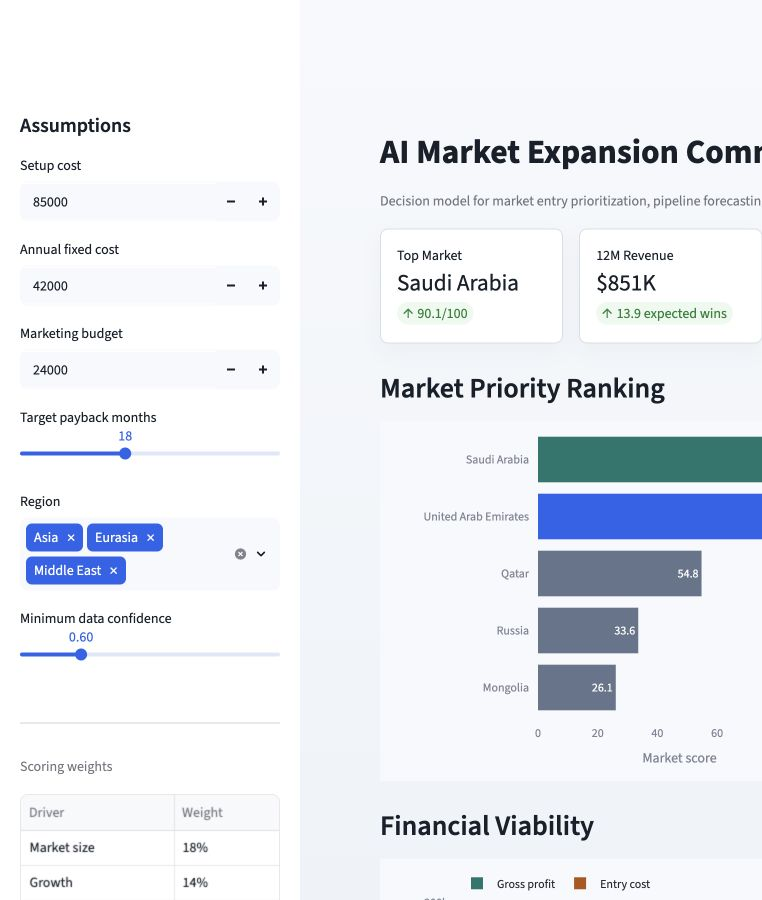

# AI Market Expansion Command Center

A portfolio-grade decision app for ranking international expansion markets using market sizing, finance modeling, pipeline forecasting, risk scoring, and an executive recommendation memo.

**Live demo:** https://market-expansion-command-center.streamlit.app/



## What It Shows

- TAM/SAM market prioritization
- Revenue, gross profit, net contribution, and payback modeling
- Sales pipeline forecasting from leads, qualification, and win-rate assumptions
- Risk scoring across competition, regulation, logistics, tariffs, FX, and payment cycles
- Executive memo generation based on the model output

## Decision Workflow

1. Filter markets by region and data confidence.
2. Adjust setup, fixed-cost, marketing, and payback assumptions.
3. Compare market priority, score drivers, financial viability, and pipeline forecasts.
4. Use the generated memo as an executive-ready recommendation draft.

## Scoring Methodology

The model combines eight weighted drivers:

- Market size
- Expected growth
- Profitability
- Pipeline value
- Strategic fit
- Channel access
- Risk
- Data confidence

Risk includes competition, regulatory complexity, FX exposure, payment cycles, logistics cost, and tariff exposure. The sample dataset is intentionally small and transparent so the assumptions can be reviewed and replaced.

## Run Locally

```bash
python3 -m venv .venv
source .venv/bin/activate
python -m pip install -r requirements.txt
streamlit run app.py
```

Or use the helper script:

```bash
./run_app.sh
```

## Validate

```bash
python -m unittest discover -s tests
```

## Recruiter Positioning

Built an AI-powered Market Expansion Command Center combining TAM/SAM/SOM logic, pricing assumptions, sales pipeline forecasting, unit economics, payback analysis, risk scoring, and an executive recommendation memo to prioritize international market entry decisions.

## Data Note

The included data is sample data for portfolio demonstration. Replace `data/sample_markets.csv` with real market, CRM, finance, and logistics inputs before using it for a live business decision.
